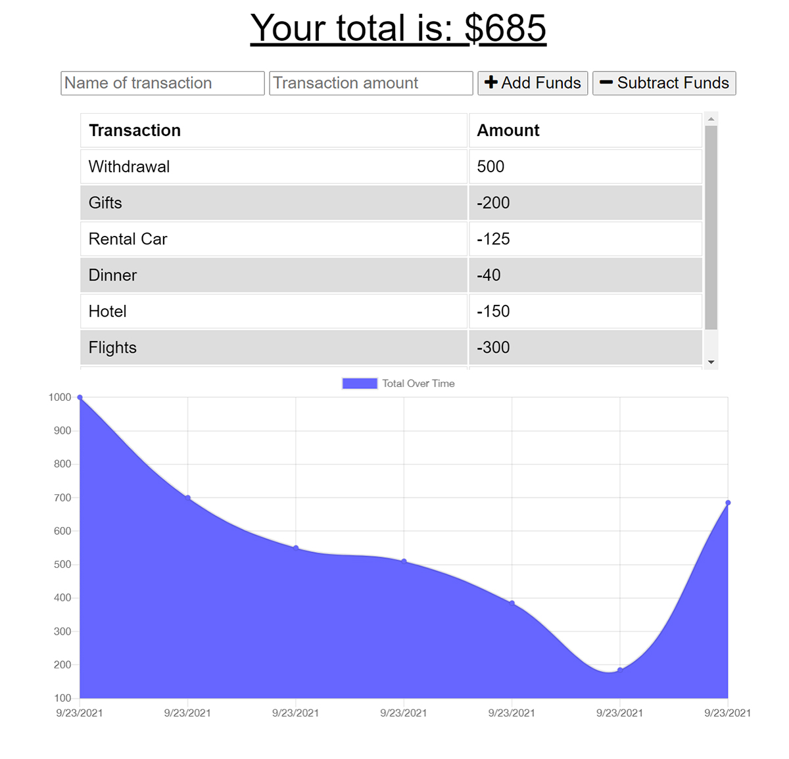

# Budget Tracker, PWA (Progressive Web App)

[](https://opensource.org/licenses/MIT)

## Description

While traveling the world you will probably encounter times when your connection to the online realm is cut short, but what shouldn’t be cut short is your financial data. This app is designed to help a user keep track of their travel budget while on the go in the form of a PWA. The app can be installed directly onto their device and will function even without an active internet connection. Transactions are saved to an indexedDB while offline and the moment a connection is reestablished those saved transactions are sent to a mongo database. Using webmanifest, service-worker, and caching, a simulated online experience is maintained for the user.

## Table of Contents

- [User Story](#user-story)
- [Live Site](#live-site)
- [Installation](#installation)
- [Technologies](#technologies)
- [License](#license)
- [Contact](#contact)

## User Story
```
AS AN avid traveller
I WANT to be able to track my withdrawals and deposits with or without a data/internet connection
SO THAT my account balance is accurate when I am traveling
```

## Live Site

https://budget-tracker-wlc.herokuapp.com/



## Installation

Because this app was designed to be a progressive web application, you can install the app to your own devices. To do so in Google Chrome, click on the triple dots in the upper right corner and choose “Install Budget Tracker...”. Now the app is installed locally and should be able to track transactions while on or offline.

## Technologies

- PWA
	- Webmanifest
	- Service-worker
	- Cache
- IndexedDB
- MongoDB
- Mongoose 
- Node.js
- Express.js

## License
Licensed under the MIT License - https://opensource.org/licenses/MIT

## Contact

If you have any questions you can email me at williamcrownover1@gmail.com.

You can also check out my other work on GitHub at [WilliamCrownover](https://github.com/WilliamCrownover)